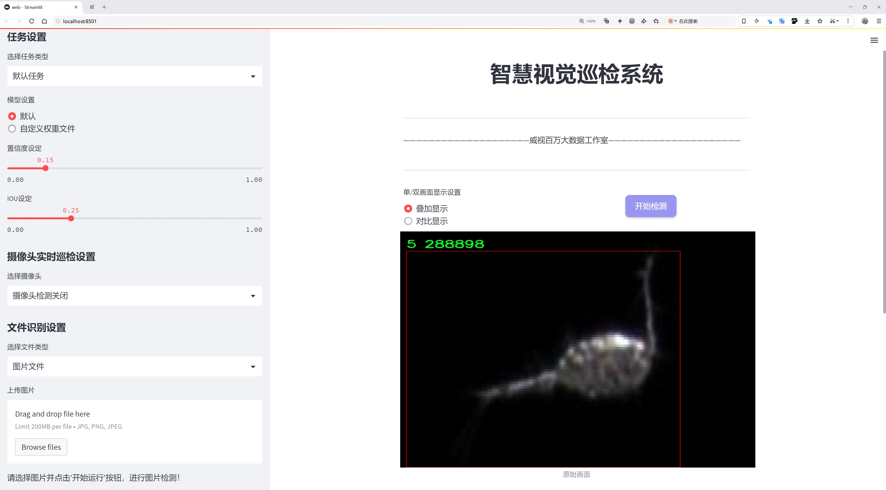
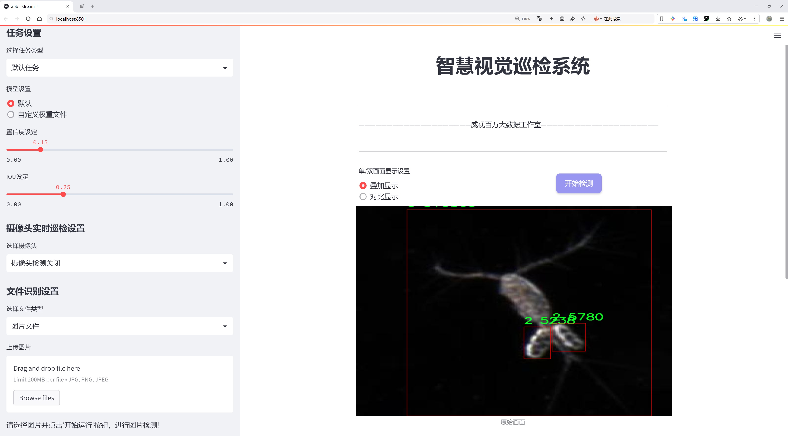
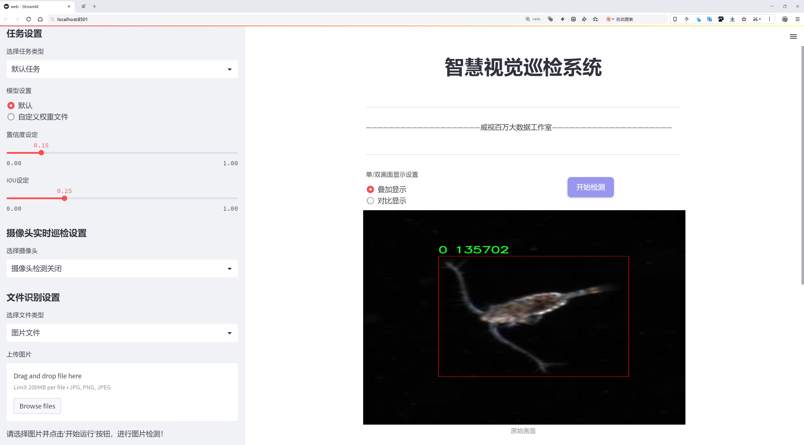
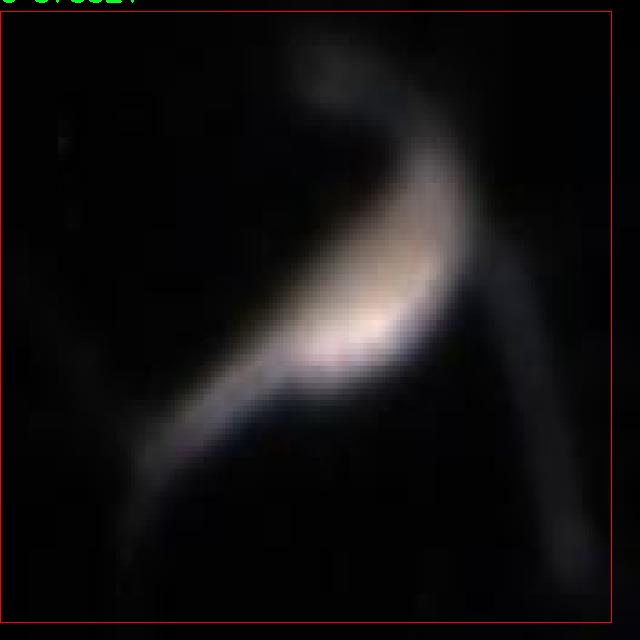
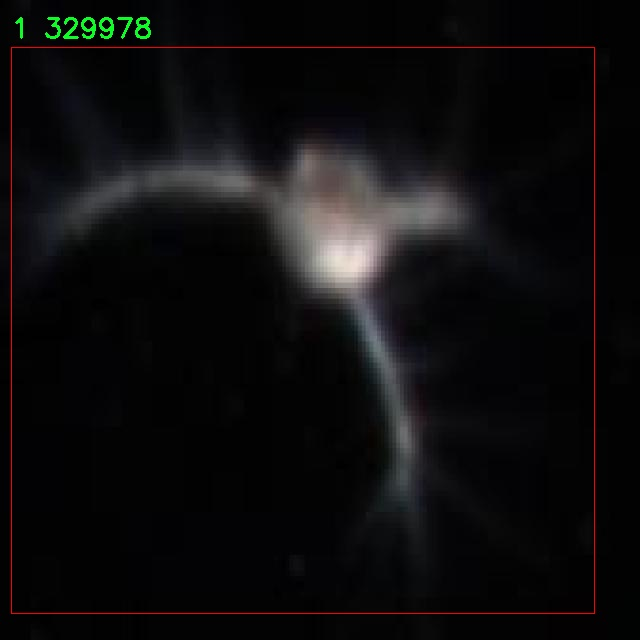
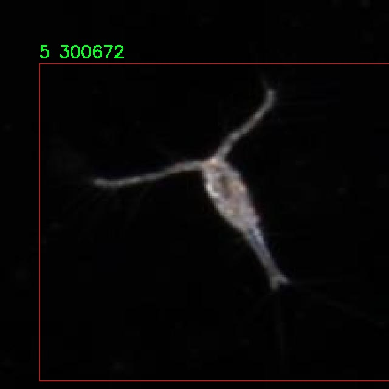
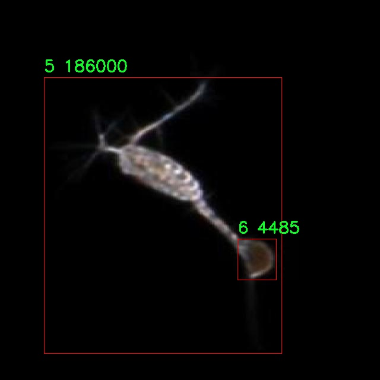
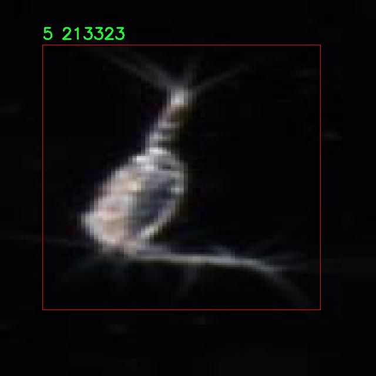

# 浮游生物检测检测系统源码分享
 # [一条龙教学YOLOV8标注好的数据集一键训练_70+全套改进创新点发刊_Web前端展示]

### 1.研究背景与意义

项目参考[AAAI Association for the Advancement of Artificial Intelligence](https://gitee.com/qunmasj/projects)

项目来源[AACV Association for the Advancement of Computer Vision](https://kdocs.cn/l/cszuIiCKVNis)

研究背景与意义

随着全球气候变化和人类活动对海洋生态系统的影响日益加剧，浮游生物作为海洋食物链的重要组成部分，其监测与研究显得尤为重要。浮游生物不仅是海洋生态系统的基础，还在全球碳循环中扮演着关键角色。因此，开发高效、准确的浮游生物检测系统，能够为海洋生态监测、资源管理及环境保护提供重要支持。

近年来，深度学习技术的迅猛发展为计算机视觉领域带来了革命性的变化，尤其是在目标检测任务中。YOLO（You Only Look Once）系列模型因其高效性和实时性而受到广泛关注。YOLOv8作为该系列的最新版本，进一步提升了检测精度和速度，适用于多种复杂场景的目标检测任务。然而，针对浮游生物这一特定领域，现有的YOLOv8模型仍需进行针对性的改进，以适应浮游生物的多样性和复杂性。

本研究旨在基于改进的YOLOv8模型，构建一个高效的浮游生物检测系统。数据集的构建是该系统成功的关键因素之一。本研究所使用的数据集包含5500幅图像，涵盖8个浮游生物类别。这些图像不仅数量充足，而且涵盖了浮游生物在不同环境和条件下的多样性，为模型的训练和验证提供了坚实的基础。通过对这些图像的深入分析与处理，研究者能够提取出浮游生物的特征信息，从而提高模型的检测能力。

在浮游生物检测中，准确识别不同类别的浮游生物对于生态研究和环境监测至关重要。通过改进YOLOv8模型，本研究将针对浮游生物的特征进行优化，提升模型在不同类别间的区分能力。这不仅有助于提高检测的准确性，还能加快检测速度，满足实时监测的需求。此外，改进后的模型还将为后续的自动化监测系统奠定基础，推动浮游生物研究的智能化发展。

本研究的意义不仅在于技术层面的创新，更在于其对海洋生态保护的实际贡献。通过建立高效的浮游生物检测系统，研究者能够更好地监测浮游生物的种群变化，分析其与环境因素之间的关系。这对于理解海洋生态系统的动态变化、评估人类活动对海洋环境的影响、以及制定相应的保护措施具有重要的现实意义。

综上所述，基于改进YOLOv8的浮游生物检测系统的研究，不仅为浮游生物的监测提供了新的技术手段，也为海洋生态研究提供了新的视角和方法。通过对浮游生物的深入研究，我们能够更好地理解和保护海洋生态系统，为可持续发展贡献力量。

### 2.图片演示







##### 注意：由于此博客编辑较早，上面“2.图片演示”和“3.视频演示”展示的系统图片或者视频可能为老版本，新版本在老版本的基础上升级如下：（实际效果以升级的新版本为准）

  （1）适配了YOLOV8的“目标检测”模型和“实例分割”模型，通过加载相应的权重（.pt）文件即可自适应加载模型。

  （2）支持“图片识别”、“视频识别”、“摄像头实时识别”三种识别模式。

  （3）支持“图片识别”、“视频识别”、“摄像头实时识别”三种识别结果保存导出，解决手动导出（容易卡顿出现爆内存）存在的问题，识别完自动保存结果并导出到tempDir中。

  （4）支持Web前端系统中的标题、背景图等自定义修改，后面提供修改教程。

  另外本项目提供训练的数据集和训练教程,暂不提供权重文件（best.pt）,需要您按照教程进行训练后实现图片演示和Web前端界面演示的效果。

### 3.视频演示

[3.1 视频演示](https://www.bilibili.com/video/BV12BsUeBEDu/)

### 4.数据集信息展示

##### 4.1 本项目数据集详细数据（类别数＆类别名）

nc: 8
names: ['0', '1', '2', '3', '4', '5', '6', '7']


##### 4.2 本项目数据集信息介绍

数据集信息展示

在本研究中，我们使用了名为“Plankton detection”的数据集，以支持对浮游生物检测系统的改进，特别是针对YOLOv8模型的训练与优化。该数据集的设计旨在提供丰富且多样化的浮游生物样本，以便于模型在实际应用中能够准确识别和分类不同种类的浮游生物。数据集包含8个类别，分别标记为‘0’到‘7’，这些类别代表了不同类型的浮游生物，每个类别的样本数量和质量都经过精心挑选，以确保训练的有效性和模型的泛化能力。

在浮游生物的研究中，数据集的构建至关重要，因为浮游生物种类繁多且形态各异，涵盖了从微小的单细胞生物到较大的多细胞生物的广泛范围。通过对“Plankton detection”数据集的深入分析，我们可以发现每个类别的样本都具有独特的特征和标识，这为YOLOv8模型的训练提供了坚实的基础。具体而言，类别‘0’可能代表某种常见的浮游植物，而类别‘1’则可能是特定的浮游动物，其他类别同样各具特色，涵盖了不同生态环境下的浮游生物种类。

数据集的构建过程涉及到多个步骤，包括样本的采集、图像的标注以及数据的预处理。每个样本图像都经过专业人员的标注，确保每个浮游生物的边界框和类别标签的准确性。这一过程不仅提高了数据集的质量，也为后续的模型训练提供了可靠的依据。此外，数据集中的图像来自不同的水域和生态环境，反映了浮游生物在自然界中的多样性和复杂性。这种多样性使得模型在训练过程中能够学习到不同环境下浮游生物的特征，从而提升其在实际应用中的适应能力。

为了进一步增强模型的鲁棒性，数据集还包含了一些经过数据增强处理的样本。这些增强技术包括旋转、缩放、翻转和颜色调整等，旨在模拟不同的拍摄条件和环境变化。这种多样化的训练数据不仅提高了模型的泛化能力，也使得其在面对实际应用中可能遇到的各种情况时，能够表现得更加出色。

在训练过程中，我们将“Plankton detection”数据集与YOLOv8模型相结合，利用其强大的特征提取和实时检测能力，旨在实现高效且准确的浮游生物检测。通过对数据集的深入分析和模型的不断优化，我们期望能够在浮游生物的自动检测和分类领域取得显著的进展，为生态监测和水质评估等应用提供更为精准的技术支持。

综上所述，“Plankton detection”数据集不仅为浮游生物的检测提供了丰富的样本资源，也为YOLOv8模型的训练奠定了坚实的基础。通过充分利用这一数据集，我们希望能够推动浮游生物检测技术的发展，为生态环境保护和科学研究做出贡献。











### 5.全套项目环境部署视频教程（零基础手把手教学）

[5.1 环境部署教程链接（零基础手把手教学）](https://www.ixigua.com/7404473917358506534?logTag=c807d0cbc21c0ef59de5)


[5.2 安装Python虚拟环境创建和依赖库安装视频教程链接（零基础手把手教学）](https://www.ixigua.com/7404474678003106304?logTag=1f1041108cd1f708b01a)

### 6.手把手YOLOV8训练视频教程（零基础小白有手就能学会）

[6.1 手把手YOLOV8训练视频教程（零基础小白有手就能学会）](https://www.ixigua.com/7404477157818401292?logTag=d31a2dfd1983c9668658)

### 7.70+种全套YOLOV8创新点代码加载调参视频教程（一键加载写好的改进模型的配置文件）

[7.1 70+种全套YOLOV8创新点代码加载调参视频教程（一键加载写好的改进模型的配置文件）](https://www.ixigua.com/7404478314661806627?logTag=29066f8288e3f4eea3a4)

### 8.70+种全套YOLOV8创新点原理讲解（非科班也可以轻松写刊发刊，V10版本正在科研待更新）

由于篇幅限制，每个创新点的具体原理讲解就不一一展开，具体见下列网址中的创新点对应子项目的技术原理博客网址【Blog】：


[8.1 70+种全套YOLOV8创新点原理讲解链接](https://gitee.com/qunmasj/good)

### 9.系统功能展示（检测对象为举例，实际内容以本项目数据集为准）

图9.1.系统支持检测结果表格显示

  图9.2.系统支持置信度和IOU阈值手动调节

  图9.3.系统支持自定义加载权重文件best.pt(需要你通过步骤5中训练获得)

  图9.4.系统支持摄像头实时识别

  图9.5.系统支持图片识别

  图9.6.系统支持视频识别

  图9.7.系统支持识别结果文件自动保存

  图9.8.系统支持Excel导出检测结果数据


### 10.原始YOLOV8算法原理

原始YOLOv8算法原理

YOLOv8算法是由Glenn-Jocher提出的最新一代目标检测算法，延续了YOLO系列的优良传统，特别是YOLOv3和YOLOv5的设计理念，同时在多个方面进行了创新和改进。该算法的核心在于通过高效的网络结构和优化的训练策略，实现对目标的快速而准确的检测。

首先，YOLOv8在数据预处理方面延续了YOLOv5的策略，采用了多种数据增强技术来提升模型的泛化能力。这些增强手段包括马赛克增强、混合增强、空间扰动和颜色扰动等。马赛克增强通过将多张图像拼接在一起，增加了样本的多样性；混合增强则是将两张图像进行混合，进一步丰富了训练数据的特征分布；空间扰动通过随机变换图像的视角，增强了模型对不同场景的适应能力；而颜色扰动则使得模型在不同光照条件下也能保持良好的性能。这些数据预处理技术的结合，使得YOLOv8在训练过程中能够更好地学习到目标的特征，从而提升检测精度。

在网络结构方面，YOLOv8对骨干网络进行了优化，继承了YOLOv5的设计思路。YOLOv5的主干网络采用了分层的卷积结构，每次通过步长为2的3×3卷积进行特征图的降采样，并通过C3模块进一步提取特征。YOLOv8则将C3模块替换为C2f模块，C2f模块通过引入更多的分支，增强了梯度回传时的特征流动性。这种设计使得网络在训练过程中能够更有效地捕捉到不同层次的特征信息，从而提高了目标检测的准确性。

YOLOv8还继续采用了特征金字塔网络（FPN）和路径聚合网络（PAN）的结构，以实现多尺度特征的融合。FPN能够有效地整合来自不同层次的特征图，而PAN则通过自底向上的路径增强了特征的传递效率。这种结构的设计使得YOLOv8在处理不同尺寸的目标时，能够保持较高的检测精度和速度。

在检测头的设计上，YOLOv8采用了解耦头结构，这一设计源于YOLOX的创新。解耦头将分类和定位任务分开处理，分别通过两条并行的分支进行特征提取。每个分支都使用一层1×1的卷积来完成分类和定位任务，这种解耦的方式使得模型在进行目标检测时能够更好地专注于各自的任务，从而提高了整体的检测性能。

标签分配策略是YOLOv8的另一大创新点。不同于YOLOv5依赖于数据集的候选框聚类，YOLOv8采用了动态标签分配策略，具体实现上借鉴了YOLOv6的TOOD策略。该策略通过只使用目标框和目标分数，避免了候选框与真实物体尺寸不匹配的问题。YOLOv8的损失函数主要由类别损失和位置损失组成，其中类别损失采用了变焦损失（VFL Loss），而位置损失则结合了CIoU Loss和DFL Loss。VFL Loss通过不对称参数对正负样本进行加权，使得模型在训练时更加关注高质量的正样本，同时降低了负样本对损失的影响，从而有效提升了模型的学习效率。

在模型的不同版本中，YOLOv8n作为轻量级的版本，采用了C2f模块替换C3模块，并引入了CSP结构以提高特征提取的效率。该版本的设计不仅关注于模型的精度，同时也兼顾了计算速度，使得YOLOv8在实时目标检测场景中表现出色。

综上所述，YOLOv8算法通过对数据预处理、网络结构、检测头和标签分配策略等多个方面的改进，成功地提升了目标检测的性能。其创新的C2f模块、解耦头结构以及动态标签分配策略，使得YOLOv8在目标检测领域中具有了更强的竞争力，能够更好地满足实际应用中的需求。随着YOLOv8的推出，目标检测技术的研究和应用将迎来新的发展机遇。


### 11.项目核心源码讲解（再也不用担心看不懂代码逻辑）

#### 11.1 code\ui_style.py

以下是提取并注释后的核心代码部分：

```python
import base64
import streamlit as st

# 读取二进制文件并转换为 Base64 编码
def get_base64_of_bin_file(bin_file):
    # 以二进制模式打开文件
    with open(bin_file, 'rb') as file:
        data = file.read()  # 读取文件内容
    # 将读取的二进制数据进行 Base64 编码并解码为字符串
    return base64.b64encode(data).decode()

# 定义 Streamlit 应用的 CSS 样式
def def_css_hitml():
    st.markdown("""
        <style>
        /* 全局样式 */
        .css-2trqyj, .css-1d391kg, .st-bb, .st-at {
            font-family: 'Gill Sans', 'Gill Sans MT', Calibri, 'Trebuchet MS', sans-serif;  /* 设置字体 */
            background-color: #cadefc;  /* 设置背景颜色 */
            color: #21618C;  /* 设置字体颜色 */
        }

        /* 按钮样式 */
        .stButton > button {
            border: none;  /* 去掉边框 */
            color: white;  /* 字体颜色为白色 */
            padding: 10px 20px;  /* 设置内边距 */
            text-align: center;  /* 文本居中 */
            text-decoration: none;  /* 去掉下划线 */
            display: inline-block;  /* 使按钮为块级元素 */
            font-size: 16px;  /* 设置字体大小 */
            margin: 2px 1px;  /* 设置外边距 */
            cursor: pointer;  /* 鼠标悬停时显示为手型 */
            border-radius: 8px;  /* 设置圆角 */
            background-color: #9896f1;  /* 设置背景颜色 */
            box-shadow: 0 2px 4px 0 rgba(0,0,0,0.2);  /* 设置阴影效果 */
            transition-duration: 0.4s;  /* 设置过渡效果时间 */
        }
        .stButton > button:hover {
            background-color: #5499C7;  /* 鼠标悬停时背景颜色变化 */
            color: white;  /* 鼠标悬停时字体颜色为白色 */
            box-shadow: 0 8px 12px 0 rgba(0,0,0,0.24);  /* 鼠标悬停时阴影效果变化 */
        }

        /* 侧边栏样式 */
        .css-1lcbmhc.e1fqkh3o0 {
            background-color: #154360;  /* 设置侧边栏背景颜色 */
            color: #FDFEFE;  /* 设置侧边栏字体颜色 */
            border-right: 2px solid #DDD;  /* 设置右边框 */
        }

        /* 表格样式 */
        table {
            border-collapse: collapse;  /* 合并边框 */
            margin: 25px 0;  /* 设置外边距 */
            font-size: 18px;  /* 设置字体大小 */
            font-family: sans-serif;  /* 设置字体 */
            min-width: 400px;  /* 设置最小宽度 */
            box-shadow: 0 5px 15px rgba(0, 0, 0, 0.2);  /* 设置阴影效果 */
        }
        thead tr {
            background-color: #a8d8ea;  /* 表头背景颜色 */
            color: #ffcef3;  /* 表头字体颜色 */
            text-align: left;  /* 表头文本左对齐 */
        }
        th, td {
            padding: 15px 18px;  /* 设置单元格内边距 */
        }
        tbody tr {
            border-bottom: 2px solid #ddd;  /* 设置行底部边框 */
        }
        tbody tr:nth-of-type(even) {
            background-color: #D6EAF8;  /* 设置偶数行背景颜色 */
        }
        tbody tr:last-of-type {
            border-bottom: 3px solid #5499C7;  /* 最后一行底部边框 */
        }
        tbody tr:hover {
            background-color: #AED6F1;  /* 鼠标悬停时行背景颜色变化 */
        }
        </style>
        """, unsafe_allow_html=True)  # 允许使用 HTML 代码
```

### 代码分析
1. **`get_base64_of_bin_file` 函数**：此函数用于读取指定的二进制文件并将其内容转换为 Base64 编码的字符串，方便在网页中显示或传输。

2. **`def_css_hitml` 函数**：此函数定义了 Streamlit 应用的 CSS 样式，包括全局样式、按钮样式、侧边栏样式和表格样式等，旨在美化应用的界面。

3. **CSS 样式**：通过使用 CSS，开发者可以自定义应用的外观，包括字体、颜色、边框、阴影等，使用户界面更加友好和美观。

### 总结
上述代码片段展示了如何在 Streamlit 应用中处理文件和自定义样式的基本方法，核心在于文件的读取和 Base64 编码的转换，以及通过 CSS 自定义界面样式。

这个程序文件 `ui_style.py` 是一个用于 Streamlit 应用的样式定义文件。它主要包含了两个功能：读取二进制文件并将其转换为 Base64 编码，以及定义应用的 CSS 样式。

首先，文件导入了 `base64` 和 `streamlit` 模块。`base64` 模块用于处理 Base64 编码，而 `streamlit` 是一个用于构建数据应用的 Python 库。

接下来，定义了一个名为 `get_base64_of_bin_file` 的函数。这个函数接受一个二进制文件的路径作为参数，打开该文件并读取其内容，然后将读取到的二进制数据进行 Base64 编码，并以字符串形式返回。这种编码方式常用于在网页中嵌入图像或其他文件。

然后，文件中定义了一个名为 `def_css_hitml` 的函数。这个函数使用 `st.markdown` 方法将一段 CSS 样式嵌入到 Streamlit 应用中。CSS 样式主要包括全局样式、按钮样式、侧边栏样式、单选按钮样式、滑块样式和表格样式等。

在全局样式部分，设置了字体、背景颜色和文本颜色，以便整个应用看起来更加美观和一致。按钮样式部分定义了按钮的外观，包括边框、颜色、内边距、字体大小、边距、圆角和背景颜色，并添加了悬停效果，使得用户在鼠标悬停时按钮颜色变化，增加了交互性。

侧边栏样式部分设置了侧边栏的背景颜色和文本颜色，确保与全局样式相协调。单选按钮和滑块的样式也进行了定制，使得它们在视觉上更加吸引用户。

最后，表格样式部分定义了表格的外观，包括边框、字体、背景颜色和悬停效果，使得表格在显示数据时更加清晰易读。

总的来说，这个文件通过定义 CSS 样式和提供 Base64 编码功能，为 Streamlit 应用提供了美观的用户界面和更好的用户体验。

#### 11.2 70+种YOLOv8算法改进源码大全和调试加载训练教程（非必要）\ultralytics\models\yolo\segment\train.py

以下是代码中最核心的部分，并附上详细的中文注释：

```python
from ultralytics.models import yolo
from ultralytics.nn.tasks import SegmentationModel
from ultralytics.utils import DEFAULT_CFG, RANK
from ultralytics.utils.plotting import plot_images, plot_results

class SegmentationTrainer(yolo.detect.DetectionTrainer):
    """
    扩展DetectionTrainer类，用于基于分割模型的训练。
    """

    def __init__(self, cfg=DEFAULT_CFG, overrides=None, _callbacks=None):
        """初始化SegmentationTrainer对象，使用给定的参数。"""
        if overrides is None:
            overrides = {}
        overrides['task'] = 'segment'  # 设置任务类型为分割
        super().__init__(cfg, overrides, _callbacks)  # 调用父类的初始化方法

    def get_model(self, cfg=None, weights=None, verbose=True):
        """返回初始化的SegmentationModel，使用指定的配置和权重。"""
        # 创建SegmentationModel实例，通道数为3，类别数为数据集中类别的数量
        model = SegmentationModel(cfg, ch=3, nc=self.data['nc'], verbose=verbose and RANK == -1)
        if weights:
            model.load(weights)  # 如果提供了权重，则加载权重

        return model  # 返回模型实例

    def get_validator(self):
        """返回SegmentationValidator实例，用于YOLO模型的验证。"""
        self.loss_names = 'box_loss', 'seg_loss', 'cls_loss', 'dfl_loss'  # 定义损失名称
        # 创建并返回SegmentationValidator实例
        return yolo.segment.SegmentationValidator(self.test_loader, save_dir=self.save_dir, args=copy(self.args))

    def plot_training_samples(self, batch, ni):
        """创建训练样本图像的绘图，包含标签和框坐标。"""
        plot_images(batch['img'],  # 训练图像
                    batch['batch_idx'],  # 批次索引
                    batch['cls'].squeeze(-1),  # 类别标签
                    batch['bboxes'],  # 边界框
                    batch['masks'],  # 分割掩码
                    paths=batch['im_file'],  # 图像文件路径
                    fname=self.save_dir / f'train_batch{ni}.jpg',  # 保存文件名
                    on_plot=self.on_plot)  # 绘图回调

    def plot_metrics(self):
        """绘制训练/验证指标。"""
        plot_results(file=self.csv, segment=True, on_plot=self.on_plot)  # 保存结果为results.png
```

### 代码核心部分解释：
1. **导入必要的模块**：导入YOLO模型、分割模型、默认配置、排名以及绘图工具。
2. **SegmentationTrainer类**：继承自DetectionTrainer，专门用于处理分割任务的训练。
3. **初始化方法**：设置任务类型为分割，并调用父类的初始化方法。
4. **获取模型**：创建并返回一个分割模型实例，支持加载预训练权重。
5. **获取验证器**：返回一个验证器实例，用于评估模型性能，并定义损失名称。
6. **绘制训练样本**：生成训练样本的可视化图像，包含图像、类别、边界框和分割掩码。
7. **绘制指标**：绘制训练和验证过程中的指标，并保存结果图像。

该程序文件是一个用于YOLOv8模型进行图像分割任务的训练器类`SegmentationTrainer`的实现。它继承自`DetectionTrainer`类，专门用于处理图像分割的训练过程。

在文件开头，导入了一些必要的模块和类，包括`copy`模块、YOLO模型、分割模型、默认配置、排名工具以及用于绘图的函数。

`SegmentationTrainer`类的构造函数`__init__`接受三个参数：配置`cfg`、覆盖参数`overrides`和回调函数`_callbacks`。如果没有提供覆盖参数，则初始化为空字典。接着，它将任务类型设置为“segment”，并调用父类的构造函数进行初始化。

`get_model`方法用于返回一个初始化的`SegmentationModel`实例。它接受配置和权重参数，并在需要时加载指定的权重。这个方法确保模型根据提供的配置和类别数进行初始化。

`get_validator`方法返回一个`SegmentationValidator`实例，用于验证YOLO模型的性能。在这个方法中，定义了损失名称，包括边框损失、分割损失、分类损失和分布式焦点损失。它还传递了测试加载器和保存目录等参数。

`plot_training_samples`方法用于绘制训练样本的图像，包括标签和边框坐标。它接收一个批次的图像数据和批次索引，并使用`plot_images`函数生成图像的可视化结果，保存为JPEG文件。

最后，`plot_metrics`方法用于绘制训练和验证过程中的指标。它调用`plot_results`函数，生成一个结果图像，并保存为`results.png`文件。

整体来看，这个文件实现了YOLOv8模型在图像分割任务中的训练和验证过程，提供了模型初始化、验证器获取、训练样本可视化以及指标绘制等功能。

#### 11.3 ui.py

```python
import sys
import subprocess

def run_script(script_path):
    """
    使用当前 Python 环境运行指定的脚本。

    Args:
        script_path (str): 要运行的脚本路径

    Returns:
        None
    """
    # 获取当前 Python 解释器的路径
    python_path = sys.executable

    # 构建运行命令，使用 streamlit 运行指定的脚本
    command = f'"{python_path}" -m streamlit run "{script_path}"'

    # 执行命令并等待其完成
    result = subprocess.run(command, shell=True)
    
    # 检查命令执行的返回码，如果不为0则表示出错
    if result.returncode != 0:
        print("脚本运行出错。")


# 主程序入口
if __name__ == "__main__":
    # 指定要运行的脚本路径
    script_path = "web.py"  # 假设脚本在当前目录下

    # 调用函数运行脚本
    run_script(script_path)
```

### 代码注释说明：
1. **导入模块**：
   - `sys`：用于访问与 Python 解释器相关的变量和函数。
   - `subprocess`：用于创建新进程、连接到它们的输入/输出/错误管道，并获取返回码。

2. **`run_script` 函数**：
   - 功能：使用当前 Python 环境运行指定的脚本。
   - 参数：`script_path` 是要运行的脚本的路径。
   - 获取当前 Python 解释器的路径，使用 `sys.executable`。
   - 构建命令字符串，使用 `streamlit` 模块运行指定的脚本。
   - 使用 `subprocess.run` 执行命令，并等待其完成。
   - 检查返回码，如果不为0，表示脚本运行出错，打印错误信息。

3. **主程序入口**：
   - 通过 `if __name__ == "__main__":` 确保该代码块仅在脚本直接运行时执行。
   - 指定要运行的脚本路径（这里假设脚本在当前目录下）。
   - 调用 `run_script` 函数来执行指定的脚本。

这个程序文件的主要功能是使用当前的 Python 环境来运行一个指定的脚本，具体来说是运行一个名为 `web.py` 的脚本。程序首先导入了必要的模块，包括 `sys`、`os` 和 `subprocess`，这些模块提供了与系统交互和执行外部命令的功能。此外，还导入了 `abs_path` 函数，用于获取文件的绝对路径。

在 `run_script` 函数中，首先获取当前 Python 解释器的路径，这样可以确保使用正确的 Python 环境来执行脚本。接着，构建一个命令字符串，该命令使用 `streamlit` 模块来运行指定的脚本。这里使用了 `subprocess.run` 方法来执行这个命令，`shell=True` 参数允许在 shell 中执行命令。

如果脚本运行成功，`result.returncode` 将为 0；如果出现错误，则会打印出“脚本运行出错”的信息。

在文件的最后部分，使用 `if __name__ == "__main__":` 来确保只有在直接运行该文件时才会执行后面的代码。此时，指定了要运行的脚本路径 `web.py`，并调用 `run_script` 函数来执行这个脚本。

总的来说，这个程序的作用是方便地通过当前 Python 环境来运行一个 Streamlit 应用，具体的应用逻辑则在 `web.py` 文件中实现。

#### 11.4 70+种YOLOv8算法改进源码大全和调试加载训练教程（非必要）\ultralytics\data\dataset.py

以下是经过简化并添加详细中文注释的核心代码部分：

```python
import numpy as np
import torch
from pathlib import Path
from ultralytics.utils import TQDM, LOGGER, get_hash, img2label_paths, verify_image_label

# Ultralytics 数据集缓存版本
DATASET_CACHE_VERSION = '1.0.3'

class YOLODataset:
    """
    YOLO 数据集类，用于加载 YOLO 格式的目标检测和/或分割标签。

    参数:
        data (dict, optional): 数据集的 YAML 字典。默认为 None。
        use_segments (bool, optional): 如果为 True，则使用分割掩码作为标签。默认为 False。
        use_keypoints (bool, optional): 如果为 True，则使用关键点作为标签。默认为 False。
    """

    def __init__(self, data=None, use_segments=False, use_keypoints=False):
        """初始化 YOLODataset，配置分割和关键点的选项。"""
        self.use_segments = use_segments
        self.use_keypoints = use_keypoints
        self.data = data
        assert not (self.use_segments and self.use_keypoints), '不能同时使用分割和关键点。'

    def cache_labels(self, path=Path('./labels.cache')):
        """
        缓存数据集标签，检查图像并读取形状。

        参数:
            path (Path): 缓存文件保存路径（默认: Path('./labels.cache')）。
        返回:
            (dict): 标签字典。
        """
        x = {'labels': []}
        nm, nf, ne, nc, msgs = 0, 0, 0, 0, []  # 统计缺失、找到、空、损坏的图像数量
        total = len(self.im_files)  # 图像文件总数
        
        # 使用多线程验证图像和标签
        with ThreadPool(NUM_THREADS) as pool:
            results = pool.imap(func=verify_image_label,
                                iterable=zip(self.im_files, self.label_files))
            pbar = TQDM(results, desc='扫描中...', total=total)
            for im_file, lb, shape, segments, keypoint, nm_f, nf_f, ne_f, nc_f, msg in pbar:
                nm += nm_f
                nf += nf_f
                ne += ne_f
                nc += nc_f
                if im_file:
                    x['labels'].append(
                        dict(
                            im_file=im_file,
                            shape=shape,
                            cls=lb[:, 0:1],  # 类别
                            bboxes=lb[:, 1:],  # 边界框
                            segments=segments,
                            keypoints=keypoint,
                            normalized=True,
                            bbox_format='xywh'))  # 边界框格式
                if msg:
                    msgs.append(msg)
                pbar.desc = f'扫描中... {nf} 图像, {nm + ne} 背景, {nc} 损坏'
            pbar.close()

        if msgs:
            LOGGER.info('\n'.join(msgs))  # 记录警告信息
        x['hash'] = get_hash(self.label_files + self.im_files)  # 生成数据集哈希
        save_dataset_cache_file('YOLODataset', path, x)  # 保存缓存文件
        return x

    def get_labels(self):
        """返回 YOLO 训练的标签字典。"""
        self.label_files = img2label_paths(self.im_files)  # 获取标签文件路径
        cache_path = Path(self.label_files[0]).parent.with_suffix('.cache')  # 缓存文件路径
        
        # 尝试加载缓存文件
        try:
            cache = load_dataset_cache_file(cache_path)
            assert cache['version'] == DATASET_CACHE_VERSION  # 检查版本
            assert cache['hash'] == get_hash(self.label_files + self.im_files)  # 检查哈希
        except (FileNotFoundError, AssertionError):
            cache = self.cache_labels(cache_path)  # 如果失败则缓存标签

        labels = cache['labels']  # 获取标签
        if not labels:
            LOGGER.warning(f'警告 ⚠️ 在 {cache_path} 中未找到图像，训练可能无法正常工作。')
        self.im_files = [lb['im_file'] for lb in labels]  # 更新图像文件列表
        return labels  # 返回标签

    @staticmethod
    def collate_fn(batch):
        """将数据样本合并为批次。"""
        new_batch = {}
        keys = batch[0].keys()
        values = list(zip(*[list(b.values()) for b in batch]))
        for i, k in enumerate(keys):
            value = values[i]
            if k == 'img':
                value = torch.stack(value, 0)  # 将图像堆叠为一个张量
            if k in ['masks', 'keypoints', 'bboxes', 'cls']:
                value = torch.cat(value, 0)  # 将掩码、关键点、边界框和类别合并
            new_batch[k] = value
        return new_batch  # 返回合并后的批次
```

### 代码注释说明
1. **类的定义**：`YOLODataset`类用于处理YOLO格式的数据集，包含初始化和标签缓存等功能。
2. **初始化方法**：在初始化时设置是否使用分割和关键点，并确保这两者不能同时使用。
3. **缓存标签**：`cache_labels`方法负责验证图像和标签的有效性，并将结果缓存到指定路径。
4. **获取标签**：`get_labels`方法尝试加载缓存的标签，如果失败则调用`cache_labels`方法进行缓存。
5. **合并批次**：`collate_fn`静态方法用于将多个样本合并为一个批次，适用于PyTorch的数据加载。

这样处理后的代码更加简洁，注释也能帮助理解每个部分的功能。

这个程序文件主要定义了一个用于YOLO（You Only Look Once）目标检测和分类任务的数据集类，提供了加载和处理数据集的功能。文件中包含了多个类和方法，主要分为YOLO数据集、分类数据集和语义分割数据集。

首先，YOLODataset类继承自BaseDataset，主要用于加载YOLO格式的目标检测和分割标签。构造函数接受一些参数，包括数据集的配置、是否使用分割掩码和关键点。类中定义了多个方法，其中cache_labels方法用于缓存数据集标签，检查图像并读取形状。该方法使用多线程来提高处理效率，并通过验证图像和标签的有效性来收集统计信息。

get_labels方法返回YOLO训练所需的标签字典，首先尝试加载缓存文件，如果缓存文件不存在或不匹配，则调用cache_labels方法生成新的缓存。build_transforms方法用于构建数据增强的转换操作，支持多种数据增强策略。close_mosaic方法则用于关闭马赛克增强功能，并重新构建转换操作。

update_labels_info方法用于自定义标签格式，将边界框、分割和关键点信息整合到一个实例对象中。collate_fn方法则负责将多个数据样本合并成一个批次，适用于PyTorch的数据加载器。

接下来，ClassificationDataset类继承自torchvision.datasets.ImageFolder，专门用于YOLO分类任务。它的构造函数接收数据集路径、参数设置、增强选项和缓存设置。__getitem__方法返回指定索引的数据和目标，支持从内存或磁盘加载图像。verify_images方法用于验证数据集中所有图像的有效性。

最后，文件中还定义了load_dataset_cache_file和save_dataset_cache_file两个函数，用于加载和保存数据集的缓存文件。SemanticDataset类目前是一个占位符，尚未实现具体的功能，但为未来的语义分割任务提供了基础。

整体来看，这个文件提供了一个灵活且高效的数据处理框架，适用于YOLO模型的训练和评估，支持多种数据增强和缓存机制，旨在提高模型训练的效率和准确性。

#### 11.5 train.py

以下是经过简化和注释的核心代码部分，主要集中在YOLO检测模型的训练过程中：

```python
import random
import numpy as np
import torch.nn as nn
from ultralytics.data import build_dataloader, build_yolo_dataset
from ultralytics.engine.trainer import BaseTrainer
from ultralytics.models import yolo
from ultralytics.nn.tasks import DetectionModel
from ultralytics.utils import LOGGER, RANK
from ultralytics.utils.torch_utils import de_parallel, torch_distributed_zero_first

class DetectionTrainer(BaseTrainer):
    """
    DetectionTrainer类，继承自BaseTrainer，用于基于YOLO模型的训练。
    """

    def build_dataset(self, img_path, mode="train", batch=None):
        """
        构建YOLO数据集。

        参数:
            img_path (str): 包含图像的文件夹路径。
            mode (str): 模式，可以是'train'或'val'，用于自定义不同的增强方法。
            batch (int, optional): 批次大小，仅用于'rect'模式。默认为None。
        """
        gs = max(int(de_parallel(self.model).stride.max() if self.model else 0), 32)  # 获取模型的最大步幅
        return build_yolo_dataset(self.args, img_path, batch, self.data, mode=mode, rect=mode == "val", stride=gs)

    def get_dataloader(self, dataset_path, batch_size=16, rank=0, mode="train"):
        """构造并返回数据加载器。"""
        assert mode in ["train", "val"]  # 确保模式有效
        with torch_distributed_zero_first(rank):  # 仅在DDP中初始化数据集.cache一次
            dataset = self.build_dataset(dataset_path, mode, batch_size)  # 构建数据集
        shuffle = mode == "train"  # 训练模式下打乱数据
        workers = self.args.workers if mode == "train" else self.args.workers * 2  # 根据模式设置工作线程数
        return build_dataloader(dataset, batch_size, workers, shuffle, rank)  # 返回数据加载器

    def preprocess_batch(self, batch):
        """对图像批次进行预处理，包括缩放和转换为浮点数。"""
        batch["img"] = batch["img"].to(self.device, non_blocking=True).float() / 255  # 将图像转换为浮点数并归一化
        if self.args.multi_scale:  # 如果启用多尺度
            imgs = batch["img"]
            sz = (
                random.randrange(self.args.imgsz * 0.5, self.args.imgsz * 1.5 + self.stride)
                // self.stride
                * self.stride
            )  # 随机选择图像大小
            sf = sz / max(imgs.shape[2:])  # 计算缩放因子
            if sf != 1:
                ns = [
                    math.ceil(x * sf / self.stride) * self.stride for x in imgs.shape[2:]
                ]  # 计算新的形状
                imgs = nn.functional.interpolate(imgs, size=ns, mode="bilinear", align_corners=False)  # 进行插值
            batch["img"] = imgs  # 更新批次图像
        return batch

    def get_model(self, cfg=None, weights=None, verbose=True):
        """返回YOLO检测模型。"""
        model = DetectionModel(cfg, nc=self.data["nc"], verbose=verbose and RANK == -1)  # 创建检测模型
        if weights:
            model.load(weights)  # 加载权重
        return model

    def plot_training_samples(self, batch, ni):
        """绘制训练样本及其注释。"""
        plot_images(
            images=batch["img"],
            batch_idx=batch["batch_idx"],
            cls=batch["cls"].squeeze(-1),
            bboxes=batch["bboxes"],
            paths=batch["im_file"],
            fname=self.save_dir / f"train_batch{ni}.jpg",
            on_plot=self.on_plot,
        )

    def plot_metrics(self):
        """从CSV文件中绘制指标。"""
        plot_results(file=self.csv, on_plot=self.on_plot)  # 保存结果图
```

### 代码注释说明：
1. **DetectionTrainer类**：这是一个用于YOLO模型训练的类，继承自基础训练类`BaseTrainer`。
2. **build_dataset方法**：用于构建YOLO数据集，支持训练和验证模式，并根据需要进行数据增强。
3. **get_dataloader方法**：构造数据加载器，支持多进程加载数据，确保在分布式训练中只初始化一次数据集。
4. **preprocess_batch方法**：对输入的图像批次进行预处理，包括归一化和可能的多尺度调整。
5. **get_model方法**：创建并返回YOLO检测模型，可以选择加载预训练权重。
6. **plot_training_samples方法**：绘制训练样本及其标注，便于可视化训练过程。
7. **plot_metrics方法**：从CSV文件中读取并绘制训练指标，帮助监控训练效果。

这个程序文件 `train.py` 是一个用于训练 YOLO（You Only Look Once）目标检测模型的脚本，继承自 `BaseTrainer` 类。程序的主要功能是构建数据集、加载数据、预处理图像、设置模型属性、获取模型、验证模型、记录损失、绘制训练样本和指标等。

首先，程序导入了必要的库和模块，包括数学运算、随机数生成、深度学习框架 PyTorch 相关的模块，以及 Ultralytics 提供的各种工具和函数。接着定义了 `DetectionTrainer` 类，该类专门用于处理基于检测模型的训练。

在 `build_dataset` 方法中，程序构建了 YOLO 数据集。用户可以指定图像路径、模式（训练或验证）以及批量大小。此方法会根据模型的步幅（stride）来调整数据集的构建。

`get_dataloader` 方法用于构建并返回数据加载器。它会根据模式（训练或验证）来决定是否打乱数据，并根据用户的设置调整工作线程的数量。通过调用 `build_dataloader` 函数，程序返回一个可以迭代的数据加载器。

`preprocess_batch` 方法对图像批次进行预处理，包括将图像缩放到适当的大小并转换为浮点数。此方法还支持多尺度训练，随机选择图像的大小进行训练，以增强模型的鲁棒性。

`set_model_attributes` 方法用于设置模型的属性，包括类别数量和类别名称。这些信息将被附加到模型中，以便在训练过程中使用。

`get_model` 方法返回一个 YOLO 检测模型，用户可以选择加载预训练权重。模型的配置和类别数量会根据数据集的情况进行调整。

`get_validator` 方法返回一个用于验证 YOLO 模型的验证器。它会记录损失名称，以便在训练过程中进行监控。

`label_loss_items` 方法用于返回带有标签的训练损失项字典。它将损失项转换为浮点数，并与损失名称关联。

`progress_string` 方法返回一个格式化的字符串，显示训练进度，包括当前的 epoch、GPU 内存使用情况、损失值、实例数量和图像大小等信息。

`plot_training_samples` 方法用于绘制训练样本及其标注，帮助可视化训练过程中的样本。

最后，`plot_metrics` 和 `plot_training_labels` 方法分别用于绘制训练过程中的指标和创建带标签的训练图。这些可视化工具可以帮助用户更好地理解模型的训练效果和数据分布。

总体而言，这个文件实现了 YOLO 模型训练的各个环节，提供了灵活的配置和可视化功能，适合用于目标检测任务的深度学习研究和应用。

#### 11.6 code\ultralytics\utils\files.py

以下是经过简化和注释的核心代码部分：

```python
import os
from pathlib import Path
from datetime import datetime

def increment_path(path, exist_ok=False, sep="", mkdir=False):
    """
    增加文件或目录路径的版本号，例如将 'runs/exp' 增加为 'runs/exp_2', 'runs/exp_3' 等。

    参数:
        path (str, pathlib.Path): 要增加的路径。
        exist_ok (bool, optional): 如果为 True，则返回原路径而不增加版本号。默认为 False。
        sep (str, optional): 路径和版本号之间的分隔符。默认为 ''。
        mkdir (bool, optional): 如果路径不存在，则创建目录。默认为 False。

    返回:
        (pathlib.Path): 增加版本号后的路径。
    """
    path = Path(path)  # 将路径转换为 Path 对象
    if path.exists() and not exist_ok:  # 如果路径存在且不允许覆盖
        path, suffix = (path.with_suffix(""), path.suffix) if path.is_file() else (path, "")  # 分离文件后缀

        # 递增路径
        for n in range(2, 9999):
            p = f"{path}{sep}{n}{suffix}"  # 创建新的路径
            if not os.path.exists(p):  # 如果新路径不存在
                break
        path = Path(p)  # 更新路径为新的路径

    if mkdir:
        path.mkdir(parents=True, exist_ok=True)  # 如果需要，创建目录

    return path  # 返回最终路径


def file_age(path=__file__):
    """返回文件最后更新后的天数。"""
    dt = datetime.now() - datetime.fromtimestamp(Path(path).stat().st_mtime)  # 计算时间差
    return dt.days  # 返回天数


def file_size(path):
    """返回文件或目录的大小（MB）。"""
    if isinstance(path, (str, Path)):
        mb = 1 << 20  # 1 MB = 1024 * 1024 bytes
        path = Path(path)  # 转换为 Path 对象
        if path.is_file():
            return path.stat().st_size / mb  # 返回文件大小
        elif path.is_dir():
            # 计算目录中所有文件的总大小
            return sum(f.stat().st_size for f in path.glob("**/*") if f.is_file()) / mb
    return 0.0  # 如果路径无效，返回 0.0
```

### 代码说明：
1. **`increment_path` 函数**：用于生成一个新的文件或目录路径，如果该路径已存在，则在其后添加一个递增的数字以避免冲突。可以选择是否创建该路径。

2. **`file_age` 函数**：计算并返回文件自最后修改以来经过的天数。

3. **`file_size` 函数**：计算并返回指定文件或目录的大小，单位为 MB。如果是目录，则计算目录下所有文件的总大小。

这个程序文件是Ultralytics YOLO项目中的一个工具模块，主要用于处理文件和目录的操作。它包含了几个重要的功能和类，下面逐一进行说明。

首先，文件定义了一个名为`WorkingDirectory`的类，它是一个上下文管理器，用于在指定的工作目录中执行代码。通过使用`@WorkingDirectory(dir)`装饰器或`with WorkingDirectory(dir):`语句，可以方便地改变当前工作目录。类的构造函数接收一个新的目录路径，并在实例化时保存当前工作目录。在`__enter__`方法中，使用`os.chdir`函数将当前工作目录更改为指定的目录，而在`__exit__`方法中则将工作目录恢复为原来的目录。

接下来，定义了一个名为`spaces_in_path`的上下文管理器，用于处理路径中包含空格的情况。如果路径中有空格，它会将空格替换为下划线，并将文件或目录复制到新的路径中。在执行上下文代码块后，再将文件或目录复制回原来的位置。这种处理方式可以避免某些系统或库在处理路径时因空格而导致的问题。

然后是`increment_path`函数，它用于递增文件或目录的路径。如果指定的路径已经存在，并且`exist_ok`参数为`False`，则会在路径后面添加一个数字后缀，以避免路径冲突。该函数还可以选择创建目录（如果`mkdir`参数为`True`），并返回增量后的路径。

`file_age`函数用于返回文件自上次更新以来的天数。它通过获取文件的最后修改时间并与当前时间进行比较来计算天数。

`file_date`函数返回文件的最后修改日期，以人类可读的格式显示，例如“2021-3-26”。

`file_size`函数用于返回文件或目录的大小（以MB为单位）。如果输入的是文件路径，它会返回该文件的大小；如果输入的是目录路径，它会计算该目录下所有文件的总大小。

最后，`get_latest_run`函数用于返回指定目录下最新的“last.pt”文件的路径，这通常用于模型训练的恢复。它使用`glob`模块查找匹配的文件，并通过`os.path.getctime`获取文件的创建时间，以确定最新的文件。

总的来说，这个文件提供了一些实用的工具函数和类，帮助用户更方便地进行文件和目录的管理，尤其是在处理与YOLO模型训练相关的文件时。

### 12.系统整体结构（节选）

### 整体功能和构架概括

该项目主要是一个基于YOLOv8的目标检测和图像分割框架，包含了模型训练、数据处理、文件管理和可视化等多个模块。整体架构设计旨在提供一个灵活、高效的环境，以便用户能够方便地进行模型训练、验证和推理。以下是各个模块的主要功能：

1. **数据处理**：包括数据集的加载、预处理和增强，支持YOLO格式的标签。
2. **模型训练**：提供训练器类，负责模型的初始化、训练过程的管理、损失计算和指标记录。
3. **文件管理**：工具函数和类用于处理文件和目录的操作，确保路径的有效性和数据的安全管理。
4. **可视化**：绘制训练样本和训练过程中的指标，帮助用户理解模型的性能和数据分布。
5. **上下文管理**：提供上下文管理器，方便在特定目录下执行代码，避免路径问题。

### 文件功能整理表

| 文件路径                                                                                      | 功能描述                                                                                   |
|----------------------------------------------------------------------------------------------|------------------------------------------------------------------------------------------|
| `code/ui_style.py`                                                                          | 定义Streamlit应用的CSS样式和Base64编码功能，用于美化用户界面。                          |
| `70+种YOLOv8算法改进源码大全和调试加载训练教程（非必要）/ultralytics/models/yolo/segment/train.py` | 实现YOLOv8图像分割模型的训练，包括数据集构建、模型初始化、训练过程管理等功能。         |
| `ui.py`                                                                                     | 运行指定的Streamlit应用脚本，方便用户启动Web界面。                                      |
| `70+种YOLOv8算法改进源码大全和调试加载训练教程（非必要）/ultralytics/data/dataset.py`         | 定义YOLO数据集类，处理数据加载、预处理和增强，支持分类和分割任务。                      |
| `train.py`                                                                                  | 负责YOLO模型的训练过程，包括数据加载、模型设置、损失记录和可视化等功能。               |
| `code/ultralytics/utils/files.py`                                                           | 提供文件和目录管理的工具函数和类，包括工作目录管理、路径处理、文件大小和日期获取等。   |
| `70+种YOLOv8算法改进源码大全和调试加载训练教程（非必要）/ultralytics/nn/backbone/VanillaNet.py` | 定义VanillaNet模型结构，可能用于YOLOv8的特征提取。                                     |
| `val.py`                                                                                    | 实现模型验证过程，评估训练好的模型在验证集上的性能。                                   |
| `70+种YOLOv8算法改进源码大全和调试加载训练教程（非必要）/ultralytics/models/sam/modules/transformer.py` | 定义Transformer模块，可能用于图像分割或特征提取。                                      |
| `70+种YOLOv8算法改进源码大全和调试加载训练教程（非必要）/ultralytics/utils/__init__.py`      | 初始化工具模块，可能包含其他工具函数的导入。                                            |
| `code/ultralytics/models/sam/modules/sam.py`                                               | 定义SAM（Segment Anything Model）模型的结构和功能，可能用于图像分割任务。              |
| `70+种YOLOv8算法改进源码大全和调试加载训练教程（非必要）/ultralytics/utils/callbacks/clearml.py` | 实现与ClearML的集成，支持训练过程中的监控和管理。                                      |
| `70+种YOLOv8算法改进源码大全和调试加载训练教程（非必要）/ultralytics/solutions/__init__.py`  | 初始化解决方案模块，可能包含特定解决方案的导入。                                        |

以上表格总结了每个文件的主要功能，帮助理解整个项目的结构和各个模块之间的关系。

注意：由于此博客编辑较早，上面“11.项目核心源码讲解（再也不用担心看不懂代码逻辑）”中部分代码可能会优化升级，仅供参考学习，完整“训练源码”、“Web前端界面”和“70+种创新点源码”以“13.完整训练+Web前端界面+70+种创新点源码、数据集获取”的内容为准。

### 13.完整训练+Web前端界面+70+种创新点源码、数据集获取


# [下载链接：https://mbd.pub/o/bread/ZpuYmp1w](https://mbd.pub/o/bread/ZpuYmp1w)